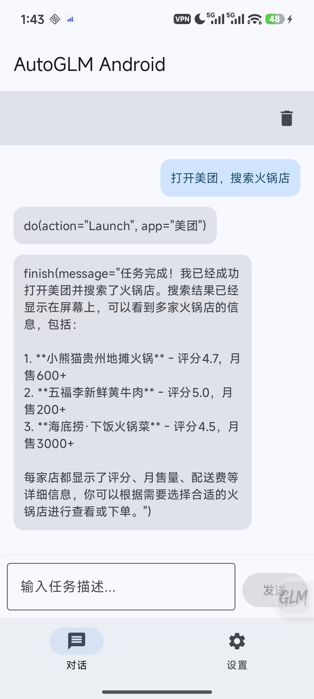

# Open-AutoGLM-Android

[English](README_EN.md) | 中文

基于 Android 无障碍服务的智能手机自动化助手，使用 AutoGLM 视觉语言模型实现自然语言指令的手机操作。

## 功能特点

- 🤖 **AI 驱动的自动化**：使用 AutoGLM 视觉语言模型理解屏幕内容并执行操作
- 📱 **无需 ADB**：完全基于 Android 无障碍服务，无需连接电脑
- 🎯 **自然语言控制**：使用自然语言描述任务，AI 自动规划并执行
- 🔄 **对话式交互**：支持多步骤任务，AI 会记住上下文并继续执行
- 🛠️ **易于使用**：简洁的界面，只需输入任务描述即可

## 界面演示



## 系统要求

- **Android 版本**：Android 11 (API 30) 或更高版本
- **设备要求**：支持无障碍服务的 Android 设备
- **网络要求**：需要网络连接以访问 AutoGLM API
- **权限要求**：
  - 无障碍服务权限（必需）
  - 网络访问权限（必需）
  - 查询所有应用权限（用于启动应用）

## 使用步骤

### 1. 安装应用

从 Release 页面下载 APK 文件并安装到您的 Android 设备上。

### 2. 配置 API

应用内置了两种预配置模型，首次启动时会自动添加到模型配置列表：

#### 选项 1：智谱 AutoGLM（推荐）
1. 打开应用，进入"设置"页面，点击"模型配置"
2. 在智谱平台申请 API Key（访问 https://open.bigmodel.cn/）
3. 选择"智谱 AutoGLM"配置并编辑：
   - **API Key**：您的智谱 API Key
   - **Base URL**：`https://open.bigmodel.cn/api/paas/v4`（已预设）
   - **Model Name**：`autoglm-phone`（已预设）
4. 点击"保存"

#### 选项 2：阿里云百炼 GUI-plus
1. 打开应用，进入"设置"页面，点击"模型配置"
2. 在阿里云百炼平台申请 API Key（访问 https://bailian.console.aliyun.com/）
3. 选择"阿里云百炼 GUI-plus"配置并编辑：
   - **API Key**：您的阿里云 DashScope API Key
   - **Base URL**：`https://dashscope.aliyuncs.com/compatible-mode/v1`（已预设）
   - **Model Name**：`gui-plus`（已预设）
4. 点击"保存"

**注意**：两个模型都支持视觉理解和手机操作自动化，您可以根据自己的需求选择使用。

### 3. 启用无障碍服务

1. 在设置页面，点击"前往设置"按钮
2. 在系统无障碍设置中找到"AutoGLM Android"
3. 开启无障碍服务
4. 返回应用，确认状态显示为"已启用"
5. 在系统设置中将本应用的 **电量消耗/电池策略** 设置为 **无限制/不受限制**，防止切到后台后任务被系统终止

### 4. 开始使用

1. 返回"对话"页面
2. 在输入框中输入您的任务描述，例如：
   - "打开QQ"
   - "打开QQ后打开xxx群"
   - "在美团上搜索奶茶"
   - "打开微信，给张三发消息"
3. 点击"发送"按钮
4. AI 会自动分析屏幕并执行操作
5. 任务完成后会显示 Toast 提示

### 5. 清理对话

- 点击顶部工具栏右侧的删除图标可以清理对话历史，开始新的会话

## 支持的操作

- **Launch**：启动应用
- **Tap**：点击屏幕坐标
- **Type**：输入文本
- **Swipe**：滑动屏幕
- **Back**：返回上一页
- **Home**：返回桌面
- **Long Press**：长按
- **Double Tap**：双击
- **Wait**：等待

## 注意事项

1. **无障碍服务**：应用需要无障碍服务权限才能正常工作，请务必开启
2. **截图功能**：需要 Android 11 或更高版本，低版本设备可能无法使用
3. **模拟器限制**：在 Android 模拟器上运行时，截图功能可能无法正常工作，建议在真机上测试
4. **网络连接**：需要稳定的网络连接以访问 AutoGLM API
5. **API 费用**：使用 AutoGLM API 可能会产生费用，请查看智谱平台的定价信息

## 常见问题

### Q: 为什么无法获取屏幕截图？

A: 请确保：
- Android 版本为 11 (API 30) 或更高
- 无障碍服务已启用
- 如果是在模拟器上，截图功能可能无法正常工作

### Q: 为什么任务执行失败？

A: 可能的原因：
- 无障碍服务未启用
- API Key 配置错误
- 网络连接问题
- 任务描述不够清晰
- 系统对本应用的电量/电池策略未设置为「无限制」，导致后台执行时被系统杀死

### Q: 阿里云 GUI-plus 模型返回 4000 错误怎么办？

A: 这个问题已在最新版本中修复。4000 错误通常是由于请求参数不合法导致的。具体原因：
- **问题**：阿里云百炼 API 不支持 `frequency_penalty` 参数
- **解决**：应用会自动检测使用的模型提供商，对阿里云 API 自动移除不支持的参数
- **确认**：请确保使用最新版本的应用，旧版本可能会遇到此问题

如果仍然遇到 4000 错误，请检查：
1. API Key 是否正确且有效
2. 模型名称是否正确（应为 "gui-plus"）
3. Base URL 是否正确配置为 `https://dashscope.aliyuncs.com/compatible-mode/v1`

### Q: 如何查看 AI 的思考过程？

A: 在对话界面中，点击助手消息中的"展开思考过程"按钮即可查看。

## 技术架构

- **UI 框架**：Jetpack Compose
- **架构模式**：MVVM (Model-View-ViewModel)
- **网络请求**：Retrofit + OkHttp
- **数据存储**：DataStore Preferences
- **异步处理**：Kotlin Coroutines + Flow
- **无障碍服务**：Android AccessibilityService API

## 开发

### 构建要求

- Android Studio Hedgehog 或更高版本
- JDK 11 或更高版本
- Android SDK API 30 或更高

### 构建步骤

```bash
# 克隆项目
git clone https://github.com/yourusername/Open-AutoGLM-Android.git

# 打开项目
cd Open-AutoGLM-Android

# 使用 Android Studio 打开项目并构建
```

## 许可证

本项目采用 MIT 许可证。详情请参阅 [LICENSE](LICENSE) 文件。

## 致谢

- 感谢 [Open-AutoGLM](https://github.com/zai-org/Open-AutoGLM) 项目提供的灵感
- 感谢智谱 AI 提供的 AutoGLM 模型

## 支持作者

如果这个项目对您有帮助，欢迎请我喝杯咖啡 ☕


## 交流群

qq交流群：734202636


---

**注意**：本项目仅供学习和研究使用。使用本应用时，请遵守相关法律法规和平台使用条款。

